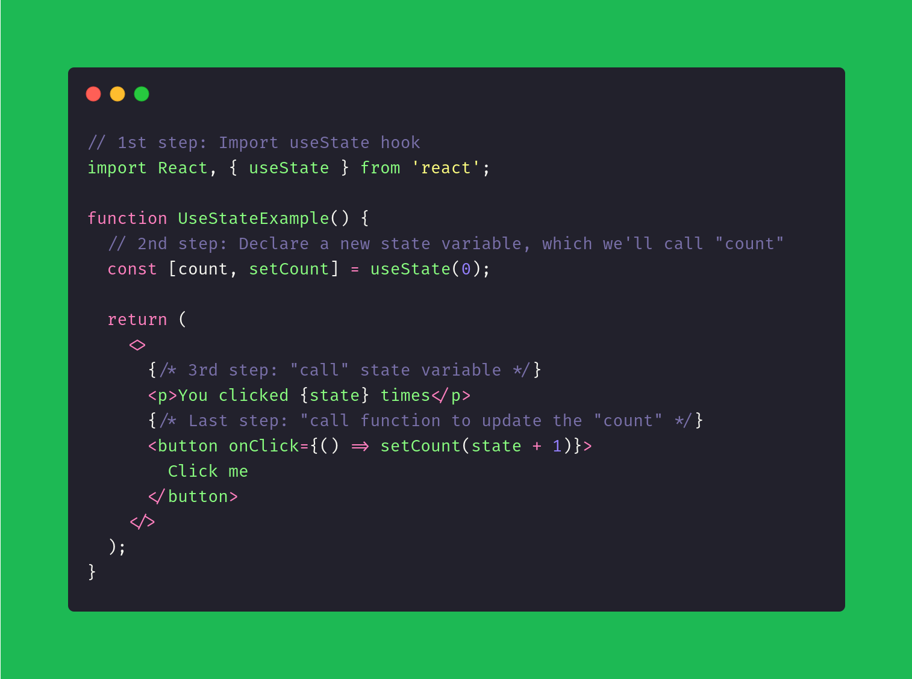
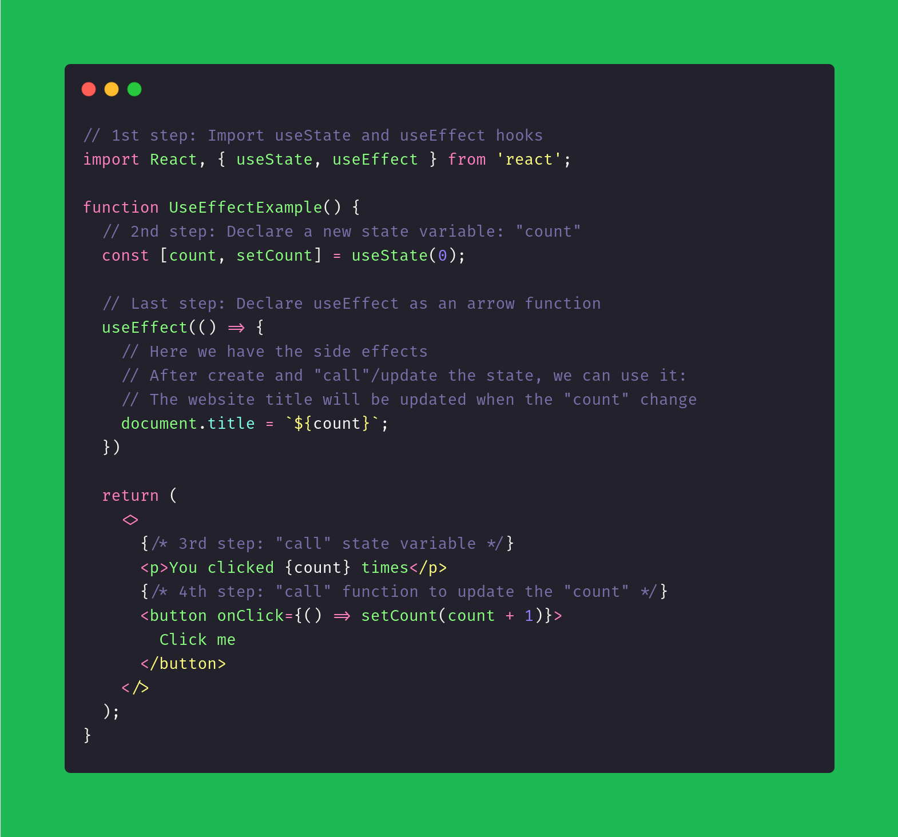
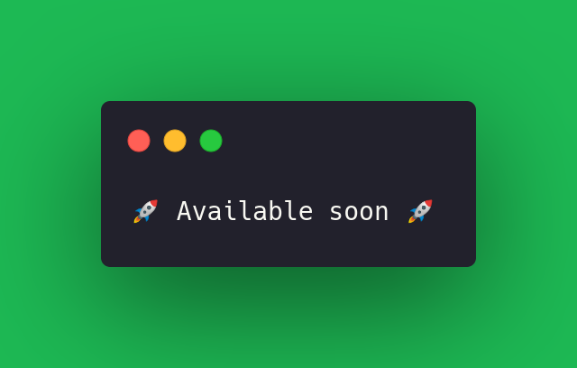

# React Hooks

## Which are the most important React Hooks?

### useState

  

[More about useState Hook](https://reactjs.org/docs/hooks-state.html)

### useEffect

  

[More about useEffect Hook](https://reactjs.org/docs/hooks-effect.html)

### useContext

  

[More about useContext Hook](https://reactjs.org/docs/hooks-reference.html#usecontext)

### useReducer

  

[More about useContext Hook](https://reactjs.org/docs/hooks-reference.html#usereducer)

### useCallback

  

[More about useContext Hook](https://reactjs.org/docs/hooks-reference.html#usecallback)

### useMemo

  

[More about useContext Hook](https://reactjs.org/docs/hooks-reference.html#usememo)

### useRef

  

[More about useContext Hook](https://reactjs.org/docs/hooks-reference.html#useref)

### Custom Hooks

  

[More about useContext Hook](https://reactjs.org/docs/hooks-custom.html)

---

To see more, access the [ReactJS oficial website](https://reactjs.org) or see the [React Hooks Playlist](https://www.youtube.com/playlist?list=PLC3y8-rFHvwisvxhZ135pogtX7_Oe3Q3A)
