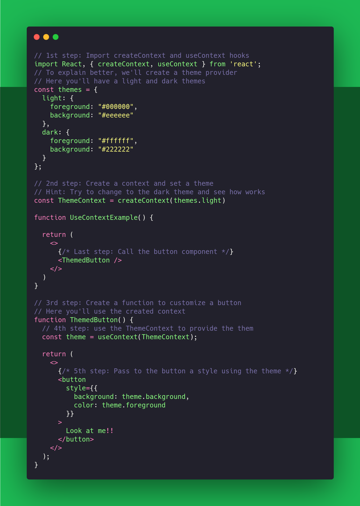
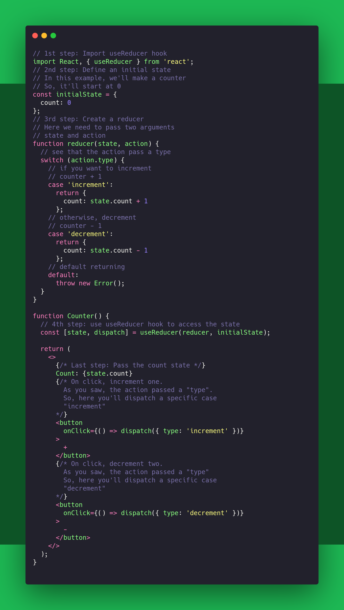
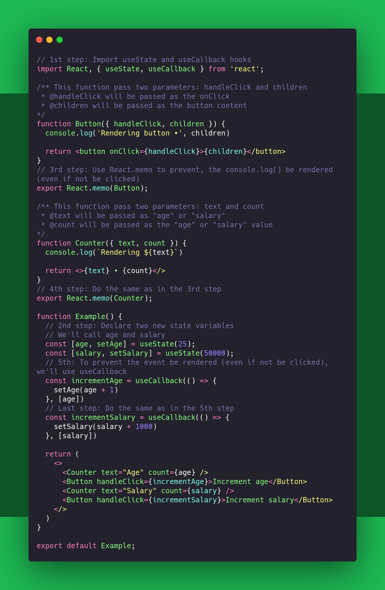
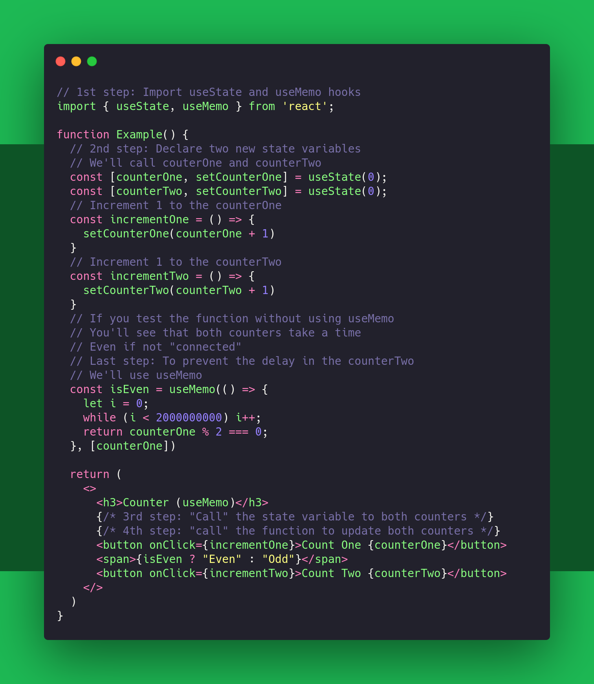
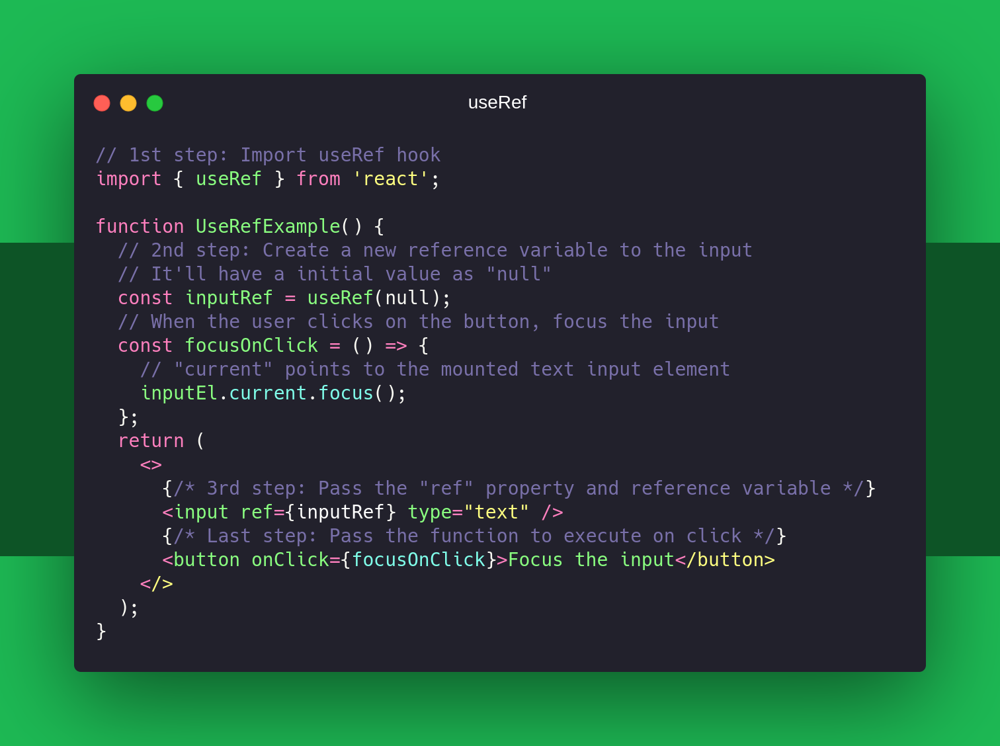
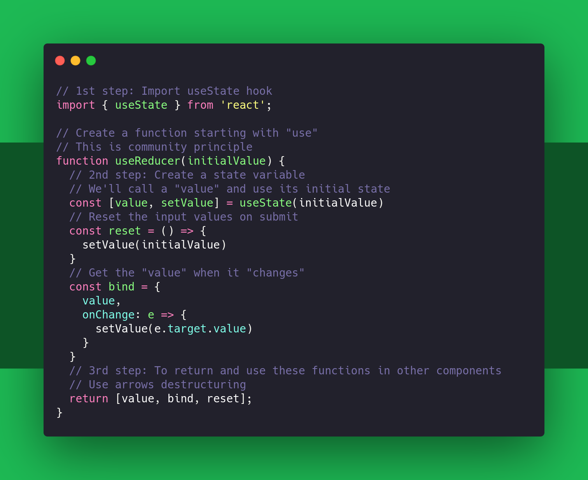
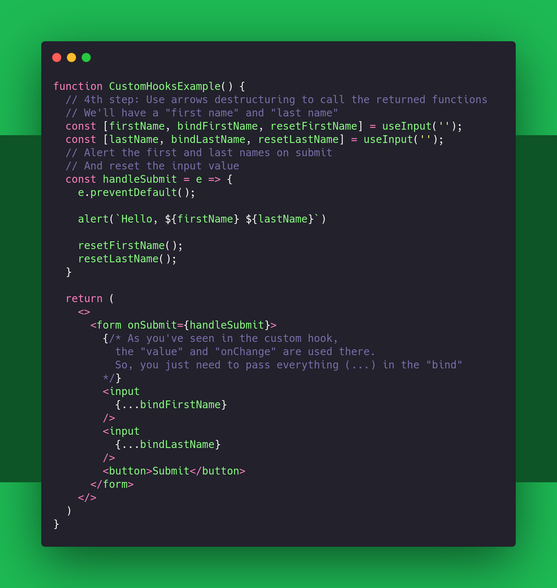

# React Hooks


## Table of Content

- [Installation](#how-do-i-start)
- [useState](#usestate)
- [useEffect](#useeffect)
- [useContext](#usecontext)
- [useReducer](#usereducer)
- [useCallback](#usecallback)
- [useMemo](#usememo)
- [useRef](#useref)
- [Custom hooks](#custom-hooks)

## Folder structure

```
React-Hooks
│   ...
│
└───src
│   │   App.js
│   │   index.js
│   │
│   └───components
│       │   
│       │   
│       └───(separated hooks folder)
│       │   │
│       │   │
│       │   └───(n examples by folder)
```

## How do I start?

You can [interact with the code](https://codesandbox.io/s/github/esau-morais/React-Hooks) using codesandbox

## Hooks rules

:warning: Before you start, you need to always remember these rules when you call a React Hook:

- _"Only call Hooks at the top level"_

  Don't call Hooks inside loops, conditions, or nested functions

- _"Only call Hooks from React functions"_

  Call them from within React functional components and not just any regular JavaScript function

## Most important React Hooks

### useState

#### Quick summary

- The `useState` hook lets you add state to functional components
- In classes, the state is always an object
- With the useState hook, the state doesn't have to be an object
- The `useState` hook returns an array with 2 elements
  - The first element is the current value of the state, and the second is a state setter function
- New state value depends on the previous state value? You can pass a function to setter function
- When dealing with objects or arrays, always make sure to spread your state variable and then call the setter function

To understand better, see the example below or [interact with the code](https://codesandbox.io/s/github/esau-morais/React-Hooks) using codesandbox

<div align="center">
  
</div>

[More about useState Hook](https://reactjs.org/docs/hooks-state.html)

[🔝 Back to Top](#table-of-content)

### useEffect

#### Quick summary

- The `Effect` Hook lets you perform side effects in functional components
- It is a close replacement for `componentDidMount`, `componentDidUpdate`, and `componentWillUnmount`

To understand better, see the example below or [interact with the code](https://codesandbox.io/s/github/esau-morais/React-Hooks) using codesandbox

<div align="center">
  
</div>

[More about useEffect Hook](https://reactjs.org/docs/hooks-effect.html)

[🔝 Back to Top](#table-of-content)

### useContext

#### Quick summary

- `Context` provides a way to pass data through the component tree without having to pass props down manually at every level

To understand better, see the example below or [interact with the code](https://codesandbox.io/s/github/esau-morais/React-Hooks) using codesandbox

<div align="center">
  
</div>

[More about useContext Hook](https://reactjs.org/docs/hooks-reference.html#usecontext)

[🔝 Back to Top](#table-of-content)

### useReducer

#### Quick summary

- `useReducer` is a Hook that is used for state management
- It is an alternative to `useState`
- `useReducer` is related to reducer functions

#### useState vs useReducer

| Scenario   |      useState      |  useReducer |
|------------|--------------------|-------------|
| Type of state |  Number, String, Boolean | Object or Array |
| Number of state transitions | One or two | Too many |
| Related state transitions? | No | Yes |
| Business logic | No business logic | Complex business logic |
| Local vs Global | Local | Global |

To understand better, see the example below or [interact with the code](https://codesandbox.io/s/github/esau-morais/React-Hooks) using codesandbox

<div align="center">
  
</div>

[More about useReducer Hook](https://reactjs.org/docs/hooks-reference.html#usereducer)

[🔝 Back to Top](#table-of-content)

### useCallback

#### Quick summary

- `useCallback` is a Hook that will return a memoized version of the callback function that only changes if one of the dependencies has changed
- It is useful when passing callbacks to optimized child components that rely on reference equality to prevent unnecessary renders

To understand better, see the example below or [interact with the code](https://codesandbox.io/s/github/esau-morais/React-Hooks) using codesandbox

<div align="center">
  
</div>

[More about useCallback Hook](https://reactjs.org/docs/hooks-reference.html#usecallback)

[🔝 Back to Top](#table-of-content)

### useMemo

<div align="center">
  
</div>

[More about useMemo Hook](https://reactjs.org/docs/hooks-reference.html#usememo)

[🔝 Back to Top](#table-of-content)

### useRef

To understand better, see the example below or [interact with the code](https://codesandbox.io/s/github/esau-morais/React-Hooks) using codesandbox

<div align="center">
  
</div>

[More about useRef Hook](https://reactjs.org/docs/hooks-reference.html#useref)

[🔝 Back to Top](#table-of-content)

### Custom Hooks

#### Quick summary

- A custom Hook is basically a JavaScript function whose name starts with `use`
- A custom Hook can also call other Hooks if required
- Share logic → Alternative to HOCs and Render Props

To understand better, see the example below or [interact with the code](https://codesandbox.io/s/github/esau-morais/React-Hooks) using codesandbox

<div align="center">
  
</div>

<div align="center">
  
</div>

[More about Custom Hooks](https://reactjs.org/docs/hooks-custom.html)

[🔝 Back to Top](#table-of-content)

---

To see more, access the [ReactJS oficial website](https://reactjs.org) or see the [React Hooks Playlist](https://www.youtube.com/playlist?list=PLC3y8-rFHvwisvxhZ135pogtX7_Oe3Q3A)

---

[LICENSE](./LICENSE)
